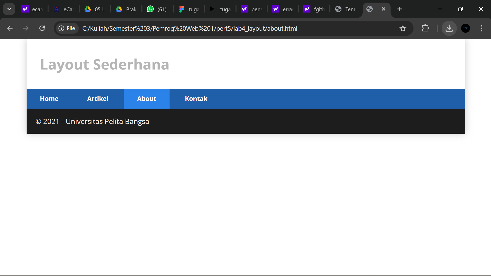
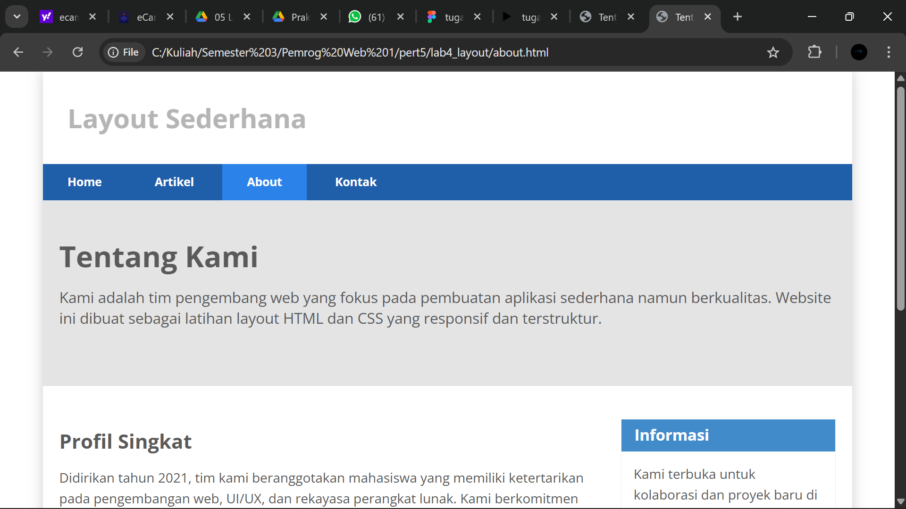
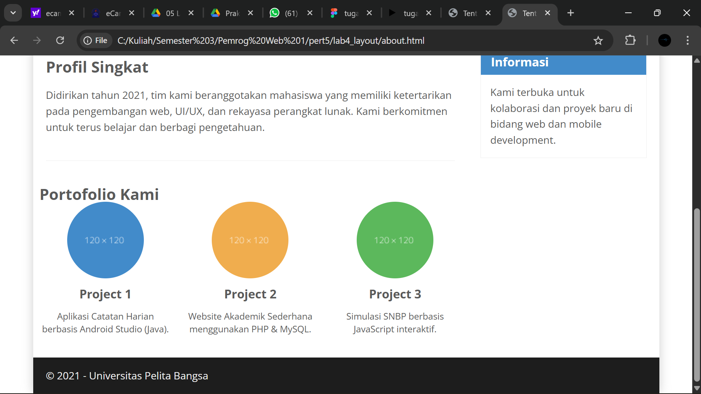
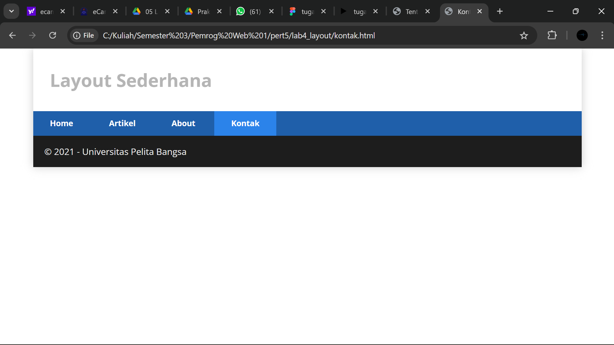
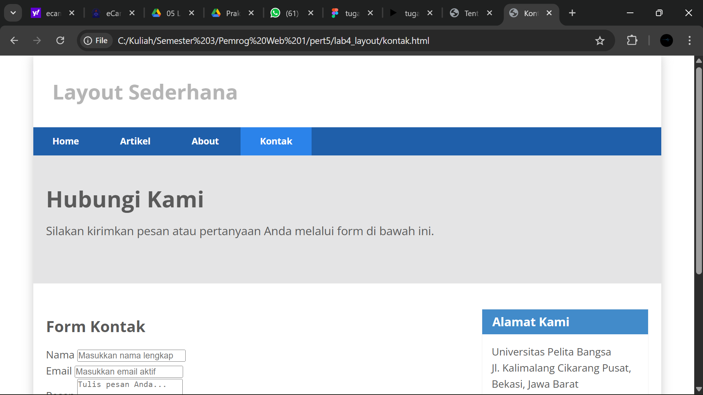
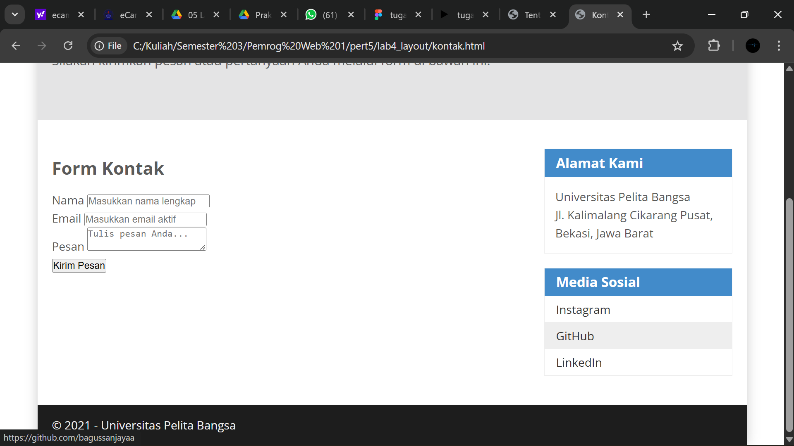
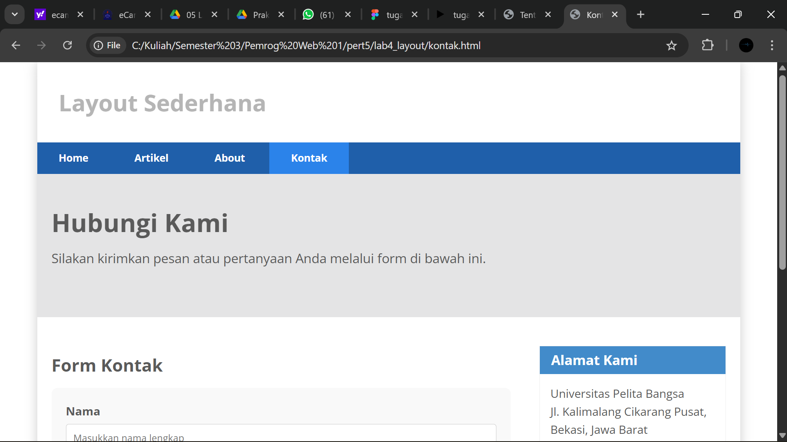
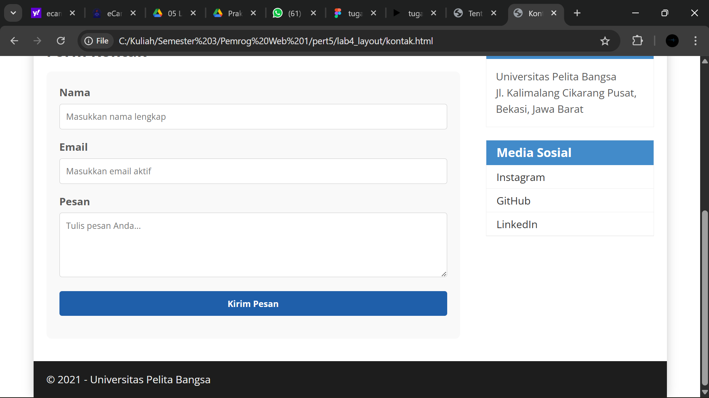

# Lab4Web

Nama : Bagus Sanjaya

Nim : 312410505

Kelas : TI.24.A.5

## Pertanyaan

1. Tambahkan Layout untuk menu About

=> buat single layout yang berisi deskripsi, portfolio, dll

2. Tambahkan layout untuk menu Contact

=> yang berisi form isian: nama, email, message, dll

## jawaban

1. Buat file baru `about.html` seperti berikut

```
<!DOCTYPE html>
<html lang="id">
<head>
    <meta charset="UTF-8">
    <meta name="viewport" content="width=device-width, initial-scale=1.0">
    <title>Tentang Kami</title>
    <link rel="stylesheet" href="style.css">
</head>
<body>
    <div id="container">

    </div>
</body>
</html>
```

- Kemudian tulis kode ini

```
<header>
    <h1>Layout Sederhana</h1>
</header>

<nav>
    <a href="home.html">Home</a>
    <a href="artikel.html">Artikel</a>
    <a href="about.html" class="active">About</a>
    <a href="kontak.html">Kontak</a>
</nav>
<footer>
    <p>&copy; 2021 - Universitas Pelita Bangsa</p>
</footer>
```



- Selanjutnya buat deskripsi, portofolio, dll

```
<section id="hero">
    <h1>Tentang Kami</h1>
    <p>Kami adalah tim pengembang web yang fokus pada pembuatan aplikasi sederhana namun berkualitas. Website ini dibuat sebagai latihan layout HTML dan CSS yang responsif dan terstruktur.</p>
</section>

<section id="main">
    <article class="entry">
        <h2>Profil Singkat</h2>
        <p>Didirikan tahun 2021, tim kami beranggotakan mahasiswa yang memiliki ketertarikan pada pengembangan web, UI/UX, dan rekayasa perangkat lunak. Kami berkomitmen untuk terus belajar dan berbagi pengetahuan.</p>
    </article>

    <hr class="divider">

    <article class="row">
        <h2>Portofolio Kami</h2>
        <div class="row">
            <div class="box">
                
                <h3>Project 1</h3>
                <p>Aplikasi Catatan Harian berbasis Android Studio (Java).</p>
            </div>
            <div class="box">
                
                <h3>Project 2</h3>
                <p>Website Akademik Sederhana menggunakan PHP & MySQL.</p>
            </div>
            <div class="box">
                
                <h3>Project 3</h3>
                <p>Simulasi SNBP berbasis JavaScript interaktif.</p>
            </div>
        </div>
    </article>
</section>

<aside id="sidebar">
    <div class="widget-box">
        <h3 class="title">Informasi</h3>
        <p>Kami terbuka untuk kolaborasi dan proyek baru di bidang web dan mobile development.</p>
    </div>
</aside>
```





2. Buat file baru `kontak.html` seperti berikut

```
<!DOCTYPE html>
<html lang="id">
<head>
    <meta charset="UTF-8">
    <meta name="viewport" content="width=device-width, initial-scale=1.0">
    <title>Kontak Kami</title>
    <link rel="stylesheet" href="style.css">
</head>
<body>
    <div id="container">

    </div>
</body>
</html>
```

- Kemudian masukan kode ini

```
<header>
    <h1>Layout Sederhana</h1>
</header>

<nav>
    <a href="home.html">Home</a>
    <a href="artikel.html">Artikel</a>
    <a href="about.html">About</a>
    <a href="kontak.html" class="active">Kontak</a>
</nav>
<footer>
    <p>&copy; 2021 - Universitas Pelita Bangsa</p>
</footer>
```



- Selanjutnya tambah form yang berisi nama, email, message, dll.

```
<section id="hero">
    <h1>Hubungi Kami</h1>
    <p>Silakan kirimkan pesan atau pertanyaan Anda melalui form di bawah ini.</p>
</section>

<section id="main">
    <article class="entry">
        <h2>Form Kontak</h2>
        <form action="#" method="post">
            <p>
                <label for="nama">Nama</label>
                <input type="text" id="nama" name="nama" placeholder="Masukkan nama lengkap" required>
            </p>
            <p>
                <label for="email">Email</label>
                <input type="email" id="email" name="email" placeholder="Masukkan email aktif" required>
            </p>
            <p>
                <label for="pesan">Pesan</label>
                <textarea id="pesan" name="pesan" placeholder="Tulis pesan Anda..." required></textarea>
            </p>
            <p>
                <input type="submit" value="Kirim Pesan">
            </p>
        </form>
    </article>
</section>

<aside id="sidebar">
    <div class="widget-box">
        <h3 class="title">Alamat Kami</h3>
        <p>Universitas Pelita Bangsa<br>Jl. Kalimalang Cikarang Pusat, Bekasi, Jawa Barat</p>
    </div>
    <div class="widget-box">
        <h3 class="title">Media Sosial</h3>
        <ul>
            <li><a href="https://instagram.com/bguscript">Instagram</a></li>
            <li><a href="https://github.com/bagussanjayaa">GitHub</a></li>
            <li><a href="#">LinkedIn</a></li>
        </ul>
    </div>
</aside>
```





- Tambahkan cssnya dengan ini

```
<style>
/* Tambahan style ringan untuk form */
form {
    background-color: #f9f9f9;
    padding: 20px;
    border-radius: 8px;
}
form p {
    margin-bottom: 15px;
}
form label {
    display: block;
    font-weight: bold;
    margin-bottom: 5px;
}
    form input, form textarea {
    width: 100%;
    padding: 10px;
    box-sizing: border-box;
    border: 1px solid #ccc;
    border-radius: 4px;
    font-family: 'Open Sans', sans-serif;
}
form textarea {
    resize: vertical;
    min-height: 100px;
}
form input[type="submit"] {
    background-color: #1f5faa;
    color: #fff;
    font-weight: bold;
    cursor: pointer;
    border: none;
    transition: background-color 0.3s ease;
}
form input[type="submit"]:hover {
    background-color: #2b83ea;
}
</style>
```




